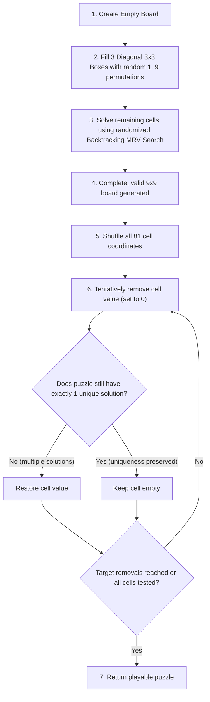

# Smart Sudoku Solver

An intelligent, interactive desktop application for generating and solving standard 9×9 Sudoku puzzles, powered by Artificial Intelligence **Constraint Satisfaction Problem (CSP)** formulation, recursive **Backtracking Search**, and the **Minimum Remaining Values (MRV)** heuristic with a Python Tkinter GUI.

---

## 📋 Table of Contents
1. [Project Title & Overview](#project-title--overview)
2. [Problem Statement](#problem-statement)
3. [Objectives](#objectives)
4. [Technologies Used](#technologies-used)
5. [Constraint Satisfaction Problem (CSP) Formulation](#constraint-satisfaction-problem-csp-formulation)
6. [Backtracking Search Algorithm](#backtracking-search-algorithm)
7. [Minimum Remaining Values (MRV) Heuristic](#minimum-remaining-values-mrv-heuristic)
8. [Sudoku Generation Approach](#sudoku-generation-approach)
9. [System Architecture](#system-architecture)
10. [How to Install](#how-to-install)
11. [How to Run](#how-to-run)
12. [How to Use](#how-to-use)
13. [Testing & Verification](#testing--verification)
14. [Limitations](#limitations)
15. [Future Enhancements](#future-enhancements)
16. [Developer & Viva Guide](#developer--viva-guide)

---

## 1. Project Title & Overview
**Smart Sudoku Solver** is an AI Foundations mini-project that bridges classical search algorithms with an interactive, responsive desktop graphical interface. It provides procedural puzzle generation with guaranteed unique solvability and instantaneous AI solving.

---

## 2. Problem Statement
Sudoku is an NP-complete combinatorial number-placement puzzle played on a $9 \times 9$ grid. Solving Sudoku purely through brute-force state-space search explores a search space of up to $9^{81} \approx 1.96 \times 10^{77}$ combinations. Plain depth-first search requires thousands of backtracks on standard puzzles. 

The challenge is to model Sudoku efficiently using AI principles (Constraint Satisfaction Problems and Heuristic Search) to reduce combinatorial branching, achieve near-instantaneous solving, and generate playable puzzles with unique solutions.

---

## 3. Objectives
- **Formalize Sudoku as a CSP**: Define variables, domains, and unary/binary constraints.
- **Implement Backtracking Search**: Design recursive depth-first backtracking search that systematically assigns and unassigns candidate values.
- **Apply the MRV Heuristic**: Integrate the *Minimum Remaining Values* ("Fail-First" / *Most Constrained Variable*) heuristic to prune impossible subtrees early.
- **Implement Procedural Generation**: Synthesize complete valid boards and selectively carve out clues while guaranteeing a unique solution.
- **Build a Desktop GUI**: Create a clean, intuitive Tkinter interface supporting grid interaction, single-digit validation, visual clue separation, and live performance metrics.
- **Ensure Academic Rigor & Modularity**: Write beginner-readable, well-documented, 100% test-covered Python code ready for viva examination.

---

## 4. Technologies Used
- **Language**: Python 3.8+
- **GUI Framework**: Tkinter (built-in standard library)
- **Numerical Operations**: NumPy (minimal external dependency)
- **Test Framework**: `unittest` (built-in standard library)

---

## 5. Constraint Satisfaction Problem (CSP) Formulation

In Artificial Intelligence, a **Constraint Satisfaction Problem (CSP)** is formalized as a triplet $\langle X, D, C \rangle$:

### 1. Variables ($X$)
The set of 81 cells on the $9 \times 9$ board:
$$X = \{ (r, c) \mid 0 \le r \le 8, \; 0 \le c \le 8 \}$$
- **Unassigned Variables**: Cells containing $0$ (empty).
- **Assigned Variables**: Cells containing fixed integers $1 \dots 9$.

### 2. Domains ($D$)
For each cell $(r, c)$, its domain $D_{(r, c)}$ consists of numbers from $\{1, 2, \dots, 9\}$ that do not violate any existing row, column, or box constraints:
$$D_{(r, c)} \subseteq \{1, 2, 3, 4, 5, 6, 7, 8, 9\}$$

### 3. Constraints ($C$)
All assignments must satisfy three global constraints:
1. **Row Uniqueness**: $\forall r \in [0..8], \forall c_1 \ne c_2 \implies \text{board}[r][c_1] \ne \text{board}[r][c_2]$
2. **Column Uniqueness**: $\forall c \in [0..8], \forall r_1 \ne r_2 \implies \text{board}[r_1][c] \ne \text{board}[r_2][c]$
3. **$3 \times 3$ Subgrid (Box) Uniqueness**: $\forall \text{cell}_1, \text{cell}_2 \in \text{Box}_b \implies \text{val}_1 \ne \text{val}_2$

---

## 6. Backtracking Search Algorithm

Backtracking Search is a systematic depth-first search that builds candidates incrementally and abandons ("backtracks") a branch as soon as it determines the candidate cannot lead to a valid solution.

### Algorithm Steps:
```python
def backtrack(board):
    # 1. Base Case: If no empty cells remain, puzzle is solved
    cell = select_unassigned_variable(board)
    if cell is None:
        return True

    row, col = cell
    candidates = get_candidates(board, row, col)

    # 2. Try each legal candidate value
    for value in candidates:
        board.set_cell(row, col, value)
        
        # 3. Recursive exploration
        if backtrack(board):
            return True
        
        # 4. Undo assignment (Backtrack) on failure
        board.set_cell(row, col, 0)
        
    # 5. Domain exhausted: trigger backtrack to parent
    return False
```

---

## 7. Minimum Remaining Values (MRV) Heuristic

The **MRV heuristic** (also known as the *Most Constrained Variable* or *Fail-First* heuristic) selects the empty cell with the **fewest remaining legal candidate values** ($|D_{(r, c)}|$):

### Why MRV Works:
1. **Minimizes Branching Factor**: Selecting a cell with only 1 candidate (a "naked single") creates a branching factor of 1 instead of 8 or 9.
2. **Fail-First Principle**: If previous assignments created a contradiction (a cell with 0 valid candidates), MRV immediately selects that cell ($|D|=0$). The search fails instantly and backtracks, avoiding thousands of futile recursive calls.

### Empirical Performance Comparison on Sample Puzzle:

| Search Strategy | Assignments | Backtracks | Execution Time | Search Efficiency |
| :--- | :--- | :--- | :--- | :--- |
| **Simple Backtracking** (Row-Major) | `4,208` | `4,157` | `~31.8 ms` | Baseline |
| **Backtracking + MRV Heuristic** | **`51`** *(exact empty count)* | **`0`** *(zero dead-ends)* | **`~10.4 ms`** | **98.8% fewer assignments (3.0x faster)** |

---

## 8. Sudoku Generation Approach

Puzzles are generated dynamically using a two-stage randomized algorithm:



### Difficulty Presets:
- **Easy**: ~45 clues remaining (36 cells removed)
- **Medium**: ~35 clues remaining (46 cells removed)
- **Hard**: ~29 clues remaining (52 cells removed)
- **Expert**: ~25 clues remaining (56 cells removed)

---

## 9. System Architecture

```
smart sudoku/
├── main.py                     # Desktop application entry point
├── requirements.txt            # Minimal dependencies (numpy)
├── .gitignore                  # Python gitignore rules
├── README.md                   # Comprehensive documentation
├── src/                        # Core application modules
│   ├── __init__.py             # Package exports (SudokuBoard, SudokuSolver, etc.)
│   ├── sudoku.py               # SudokuBoard model & constraint validation
│   ├── solver.py               # SudokuSolver (CSP Backtracking + MRV Heuristic)
│   ├── generator.py            # SudokuGenerator (Unique puzzle synthesis)
│   └── gui.py                  # Tkinter Graphical User Interface
└── tests/                      # Automated test suite (55 tests)
    ├── __init__.py
    ├── test_sudoku.py          # Board model & validation tests (27 tests)
    ├── test_solver.py          # Solver, MRV & comparison tests (10 tests)
    ├── test_generator.py       # Generator & uniqueness tests (7 tests)
    ├── test_gui.py             # GUI unit & controller tests (6 tests)
    └── test_integration.py     # End-to-end full integration tests (5 tests)
```

---

## 10. How to Install

### Prerequisites:
- Python 3.8 or higher installed on your system.
- Tkinter (standard on macOS and Windows; on Linux install via `sudo apt-get install python3-tk`).

### Step-by-step Setup:
1. Clone the repository:
   ```bash
   git clone https://github.com/yuvanvelan/smart-sudoku-solver.git
   cd smart-sudoku-solver
   ```
2. (Optional) Create and activate a virtual environment:
   ```bash
   python3 -m venv venv
   source venv/bin/activate    # On Windows: venv\Scripts\activate
   ```
3. Install dependencies:
   ```bash
   pip install -r requirements.txt
   ```

---

## 11. How to Run

Launch the desktop GUI:

```bash
python3 main.py
```

---

## 12. How to Use

1. **Create a Puzzle**:
   - Click the teal **"Create Sudoku"** button.
   - A valid, playable Sudoku puzzle will be generated with initial clues rendered in **bold dark slate** on soft gray cells.
2. **Interactive Manual Play**:
   - Click on any empty cell to type numbers `1..9`.
   - Single-digit validation automatically rejects invalid characters and multi-digit entries.
   - Use arrow keys (`↑`, `↓`, `←`, `→`) to navigate smoothly across cells.
3. **Solve with AI**:
   - Click the royal blue **"Solve Sudoku"** button.
   - The AI validates the puzzle, solves it using Backtracking + MRV, and highlights solved cells in **vibrant blue**.
4. **Live Status Feedback**:
   - The status bar at the bottom provides instant metrics:
     - *"Solution found in 10.4 ms (51 assignments, 0 backtracks)"*
     - *"Invalid puzzle: duplicate number found in row 1"*
     - *"No solution exists for this configuration"*

---

## 13. Testing & Verification

The project includes a comprehensive test suite of **55 unit and integration tests** with 100% pass rate.

### Run All Tests:
```bash
python3 -m unittest discover -s tests -p "test_*.py" -v
```

### Test Breakdown:
- **`tests/test_sudoku.py` (27 tests)**: Board creation, dimension validation (rejecting non-9x9), type checking (rejecting booleans, floats, strings), duplicate constraint checks, cell access, candidate legality, copy isolation.
- **`tests/test_solver.py` (10 tests)**: Solving known puzzles, completeness verification, unsolvable puzzle handling, candidate calculation, MRV selection, contradiction handling, MRV vs. Simple performance benchmark.
- **`tests/test_generator.py` (7 tests)**: Complete board synthesis, puzzle solvability, uniqueness verification (`count_solutions == 1`), randomness across runs, difficulty clue levels.
- **`tests/test_gui.py` (6 tests)**: Grid initialization, single-digit validation, button event callbacks, clue vs solved styling, error handling.
- **`tests/test_integration.py` (5 tests)**: Full user flow (Create -> Solve), repeated consecutive cycles (5 rounds), manual conflicting edits, unsolvable puzzle feedback.

---

## 14. Limitations
- **Constraint Propagation**: While MRV dynamically selects the most constrained variable, full forward checking or arc consistency (AC-3) is not currently maintained as a separate constraint propagation pre-pass (though MRV achieves near-instant solving for standard 9×9 grids).
- **Grid Size**: The current implementation is optimized specifically for standard $9 \times 9$ Sudoku ($3 \times 3$ subgrids).

---

## 15. Future Enhancements
- **Step-by-Step AI Visualization**: Add an interactive playback/animation mode showing the backtracking search assigning and undoing candidate values in real-time.
- **Constraint Propagation (AC-3)**: Implement the AC-3 arc-consistency algorithm to demonstrate generalized constraint propagation.
- **Difficulty Selector in GUI**: Add an interactive dropdown in the GUI to select Easy, Medium, Hard, or Expert puzzle generation.
- **Hint System**: Suggest the next logical cell to solve based on MRV domain size.

---

## 16. Developer & Viva Guide

### Key Classes & Methods:
1. **[`SudokuBoard`](file:///Users/singaravelan/projects/smart%20sudoku/src/sudoku.py)** (`src/sudoku.py`):
   - `get_cell(r, c)` / `set_cell(r, c, val)`: Cell access with boundary and type validation.
   - `is_valid_move(r, c, val)`: Core constraint checker verifying row, column, and $3 \times 3$ box uniqueness.
   - `is_valid_board()`: Verifies global consistency.
   - `copy()`: Deep copy for isolated search branches.
2. **[`SudokuSolver`](file:///Users/singaravelan/projects/smart%20sudoku/src/solver.py)** (`src/solver.py`):
   - `get_candidates(board, r, c)`: Calculates legal domain for variable $(r, c)$.
   - `select_unassigned_variable_mrv(board)`: Finds variable with minimum remaining values.
   - `solve(board, use_mrv=True)`: Recursive backtracking search with timing and statistics.
   - `count_solutions(board, limit=2)`: Bounded solution counting for uniqueness verification.
3. **[`SudokuGenerator`](file:///Users/singaravelan/projects/smart%20sudoku/src/generator.py)** (`src/generator.py`):
   - `generate_complete_board()`: Fills diagonal boxes randomly and solves remaining cells.
   - `generate_puzzle(difficulty, ensure_unique=True)`: Removes cells while preserving unique solvability.
4. **[`SudokuGUI`](file:///Users/singaravelan/projects/smart%20sudoku/src/gui.py)** (`src/gui.py`):
   - `on_create_sudoku()`: Controller callback generating puzzle and updating UI.
   - `on_solve_sudoku()`: Controller callback validating board, executing AI solve, and updating status with performance metrics.
